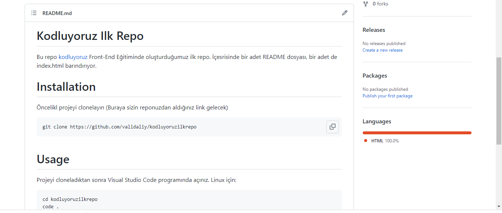

# Kodluyoruz Ilk Repo
Bu repo [kodluyoruz](https://github.com/validaliy/kodluyoruzilkrepo) Front-End Eğitiminde oluşturduğumuz ilk repo. İçesrisinde bir adet README dosyası, bir adet de index.html barındırıyor.


# Installation

Öncelikl projeyi clonelayın (Buraya sizin reponuzdan aldığınız link gelecek)
```
git clone https://github.com/validaliy/kodluyoruzilkrepo
```

# Usage

Projeyi cloneladıktan sonra Visual Studio Code programında açınız.
Linux için:
```
cd kodluyoruzilkrepo
code .
```

# Contributing

Pull requestler kabul edilir. Büyük değişiklikler için lütfen önce neyi değiştirmek istediğinizi tartışmak için bir konu açınız.

[MIT](https://choosealicense.com/)